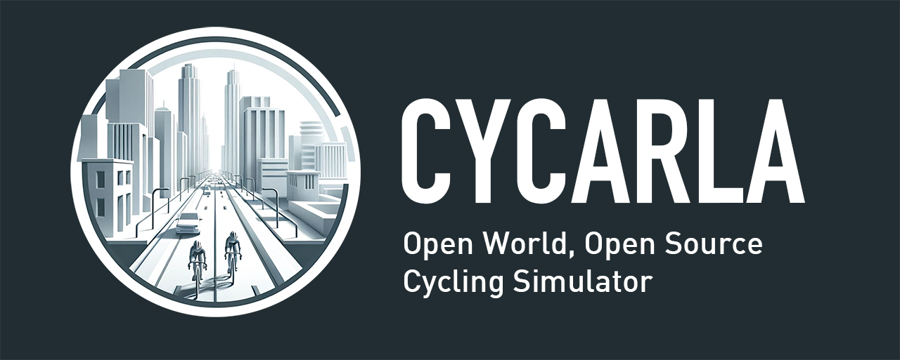
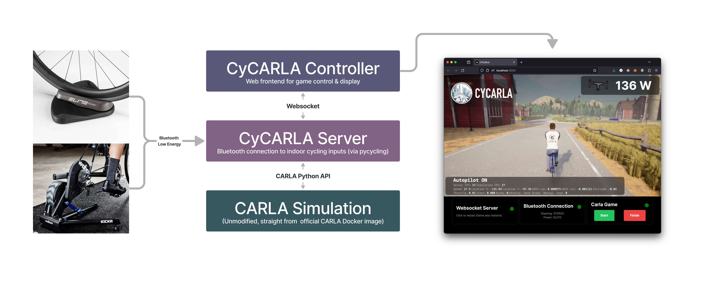

# Liberty for indoor cycling!

Pronounced: *"sai-karla"*

## Free as in Freedom

Freedom is why we ride. Try CYCARLA now to experience:

+ Freedom to explore the world, just like riding outside. 
+ Freedom to modify the game: The entire codebase is open source.

## Free as in Free Beer

Also, Cycarla is free for everyone.

Currently we support Linux machines with a GPU. See below for recommended specs.


# CyCARLA 0.2.0

Open World Cycling Simulator based on Unreal Engine and CARLA


`cycarla-controller` is a `create-next-app` project.

`cycarla-server` is a `poetry` project inside a `docker`.

## Project Structure



## Installation

```
git clone https://github.com/tensorturtle/cycarla
```

**CARLA 0.9.14**

**Docker**

```
curl -fsSL https://get.docker.com -o get-docker.sh
sh get-docker.sh
```

```
docker pull carlasim/carla:0.9.14
```

**nodejs and npm**

## Super-Quickstart

Shell 1:
```
./run_carla.sh
```

Shell 2:
```
./run_dev_server.sh
```
```
cd /workspaces/cycarla/cycarla-server
./entrypoint.sh
```

You can run `./run_server.sh` but it doesn't cache the python package installs, so it's not recommended for development.

Shell 3:
```
./run_controller.sh
```

Go to `localhost:3000` with web browser.
